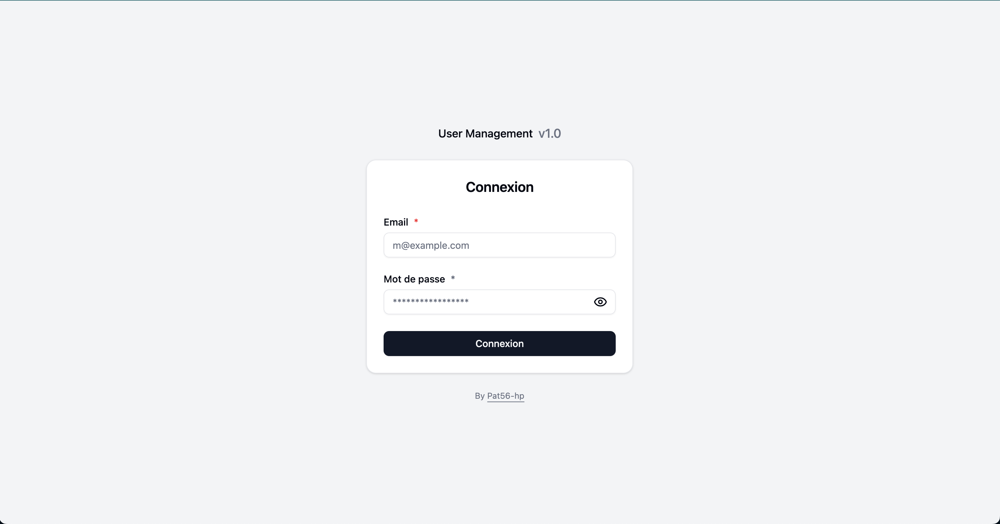
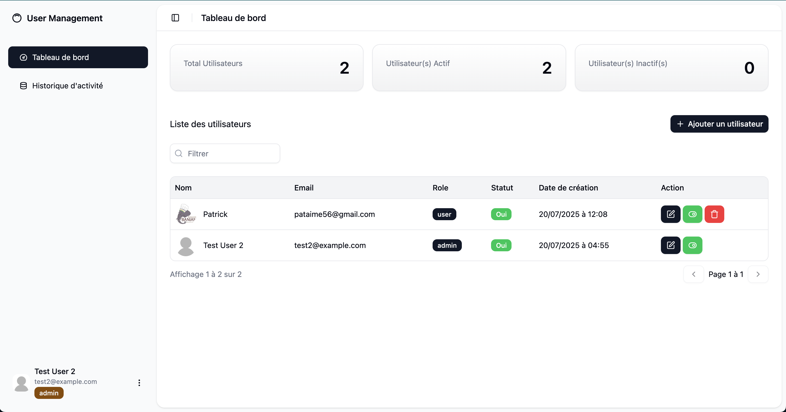
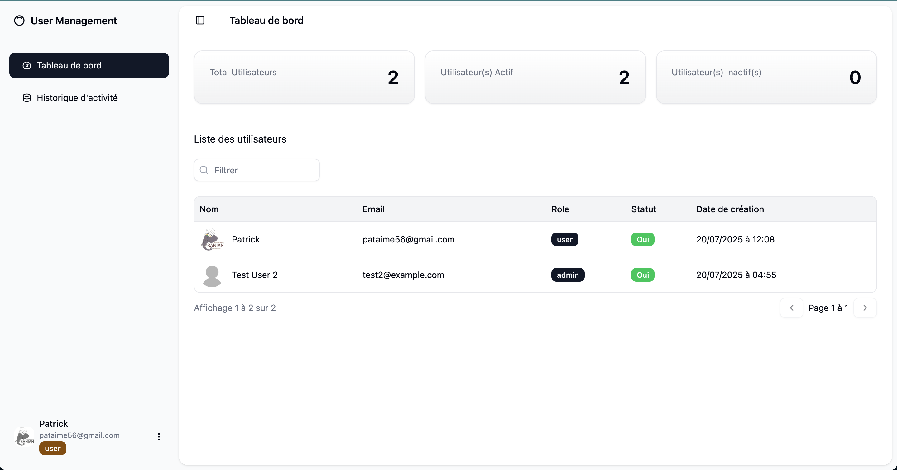
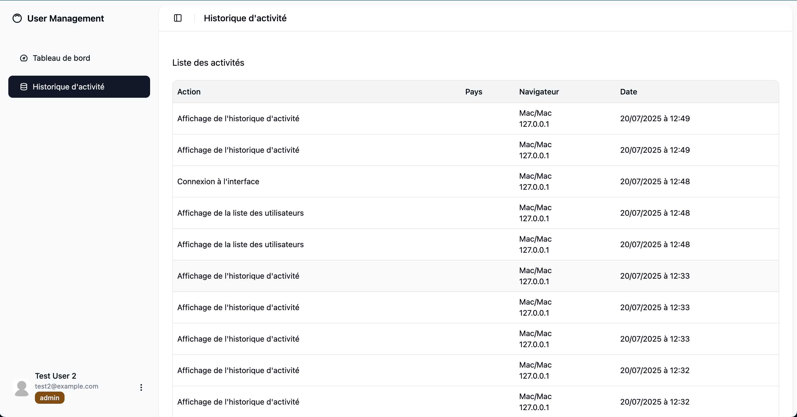
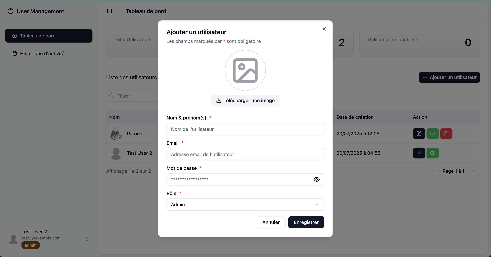
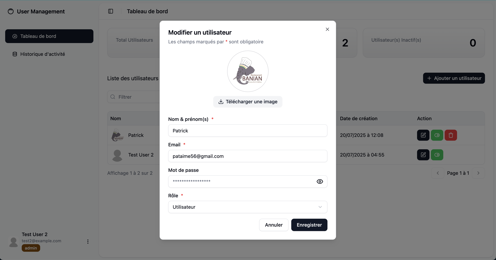
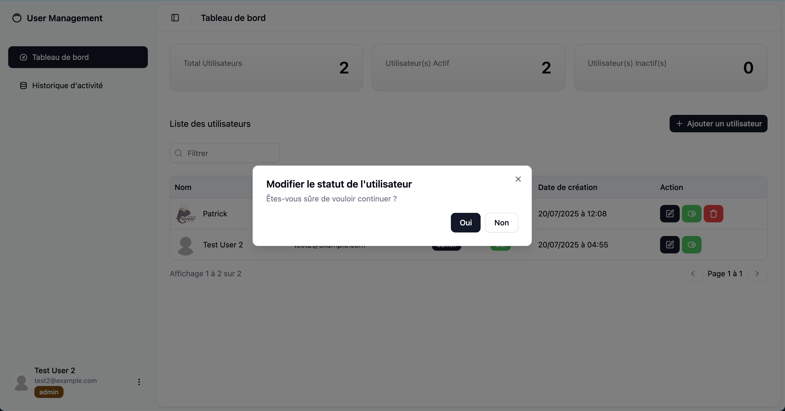

# Frontend – Gestion des Utilisateurs

Ce projet est le frontend React du mini-projet de gestion des utilisateurs. Il consomme l’API Laravel et propose une interface moderne, responsive et ergonomique.

## 🚀 Instructions d’installation

1. **Cloner le dépôt**

```bash
git clone <repo-url> frontend
cd frontend
```

2. **Installer les dépendances**

```bash
npm install
```

3. **Configurer l’URL de l’API**

Vérifiez le fichier de configuration (.env) ou les hooks d’API (`src/api/`) pour pointer vers l’URL de votre backend.

4. **Lancer l’application en développement**

```bash
npm run dev
```

5. **(Optionnel) Générer une version de production**

```bash
npm run build
```

## 🗂️ Structure du projet

- `src/`
  - `pages/` : Pages principales (`Dashboard`, `Login`, `Activities`)
  - `components/` : Composants réutilisables (tableaux, sidebar, header, formulaires, etc.)
    - `user/` : Composants liés aux utilisateurs (statut, suppression, dialogues...)
    - `ui/` : Composants UI génériques (boutons, inputs, badges, etc.)
  - `api/` : Fonctions d’appel à l’API (auth, user, activity...)
  - `hooks/` : Hooks personnalisés (auth, user, activity...)
  - `layouts/` : Layout principal de l’application
  - `assets/` : Images, icônes, etc.
- `public/` : Fichiers statiques (favicon, images, captures d’écran)

## 🛠️ Technologies utilisées

- **React 19**
- **Vite** (build ultra-rapide)
- **Tailwind CSS** (design moderne et responsive)
- **React Router DOM** (navigation)
- **Radix UI** (composants accessibles via shadcn)

## ✨ Fonctionnalités principales

- Authentification (connexion, déconnexion)
- Gestion des utilisateurs (CRUD, activation/désactivation, Upload d’avatar)
- Tableau de bord avec statistiques
- Suivi des activités utilisateur
- Filtres dynamiques, pagination
- Responsive design (mobile/desktop)

## 📸 Captures d’écran















---

Pour toute question, consultez le code source ou ouvrez une issue.
